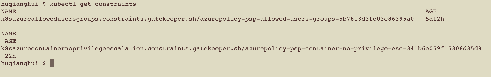
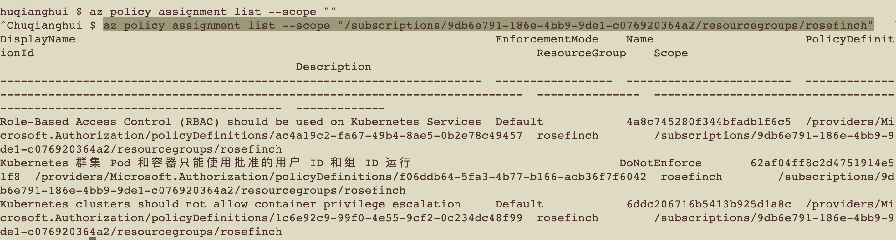

# aks演示内容

## 通过命令行查看aks的policy

通过ask constraints里面只显示数据面的policy

```shell

kubectl config use-context security-poc

kubectl get constraints
```



## 查看所有的policy

```shell

az policy assignment list --scope "/subscriptions/9db6e791-186e-4bb9-9de1-c076920364a2/resourcegroups/rosefinch"
```

