# docker演示内容

## 显示docker engine相关内容

查看cGroup，secomp，runtime等配置

```shell
docker info
```

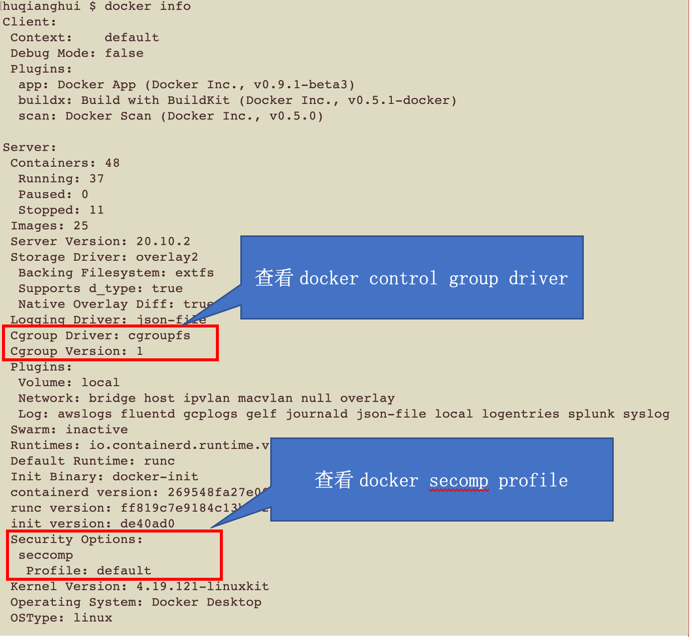

## 查看镜像文件系统

docker中的镜像采用分层构建设计，每个层可以称之为“layer”，这些layer被存放在了/var/lib/docker/<storage-driver>/目录下，
这里的storage-driver可以有很多种如:AUFS、OverlayFS、VFS、Brtfs等。
可以通过docker info命令查看存储驱动。

```shell
docker image inspect performancetuningcontainerregistry.azurecr.cn/spring-cloud-gateway:1.0.14-SNAPSHOT
```

### overlayfs

overlayfs通过三个目录：lower目录、upper目录、以及work目录实现。
其中lower目录可以是多个，work目录为工作基础目录，挂载后内容会被清空，且在使用过程中其内容用户不可见，
最后联合挂载完成给用户呈现的统一视图称为为merged目录。

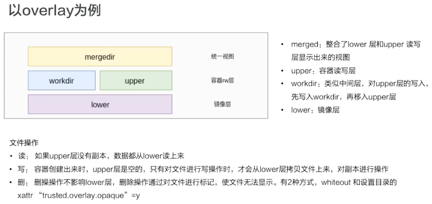

每层具体的文件存放在层标识符下的diff目录下:

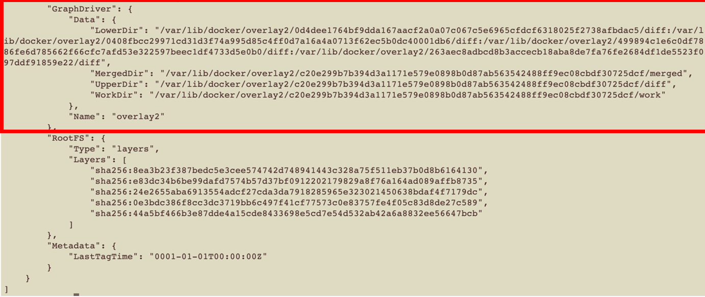

### muti-layer

多层存储：

通过docker build命令可以从 Dockerfile 生成镜像。
使用 Dockerfile 构建镜像具有以下特性：

1. Dockerfile 的每一行命令都会生成一个独立的镜像层，并且拥有唯一的 ID
2. Dockerfile 的命令是完全透明的，通过查看 Dockerfile 的内容，就可以知道镜像是如何一步步构建的
3. Dockerfile 是纯文本的，方便跟随代码一起存放在代码仓库并做版本管理

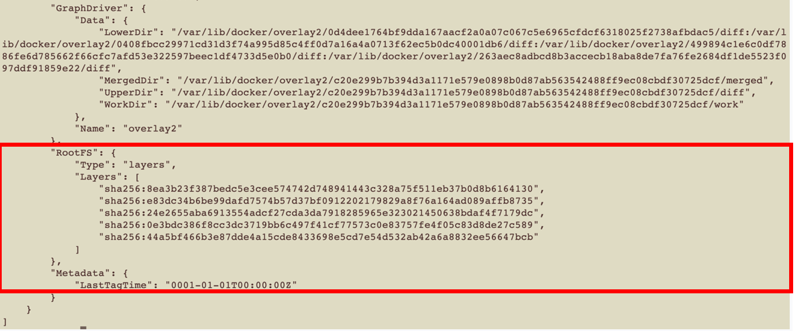

### 使用工具dive 查看

```shell
dive performancetuningcontainerregistry.azurecr.cn/spring-cloud-gateway:1.0.14-SNAPSHOT
```

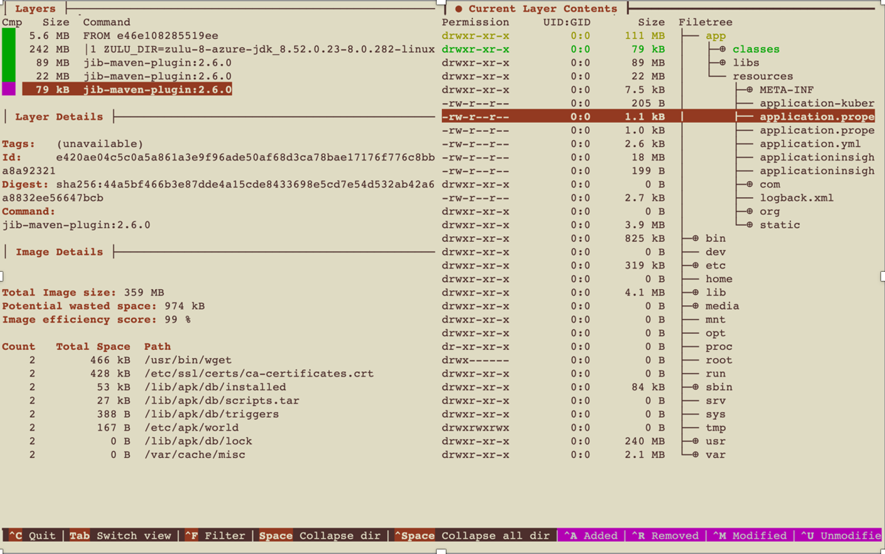

## namespace隔离

以pid信息为例，来看通过namespace实现进程信息的隔离

### 查看容器在宿主机中的PID信息

```shell
docker ps
docker inspect ee64f713b1cc
```

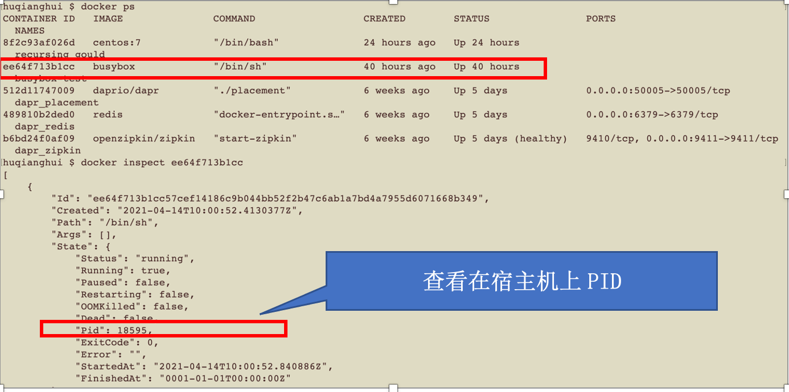

通过特权容器进去到宿主机中

```shell
docker run -it --rm --privileged --pid=host alpine:edge nsenter -t 1 -m -u -n -i sh

pstree

ps aux | grep 18595
```

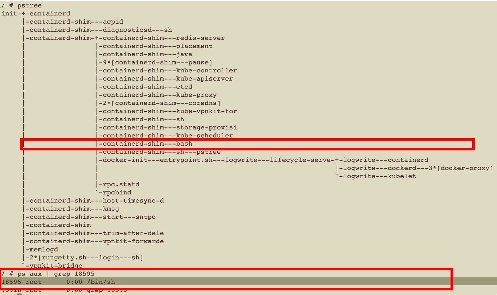

### 查看容器自身的PID 信息

通过对比，可以看到PID为1

```shell
docker ps

docker exec -it ee64f713b1cc sh 
```

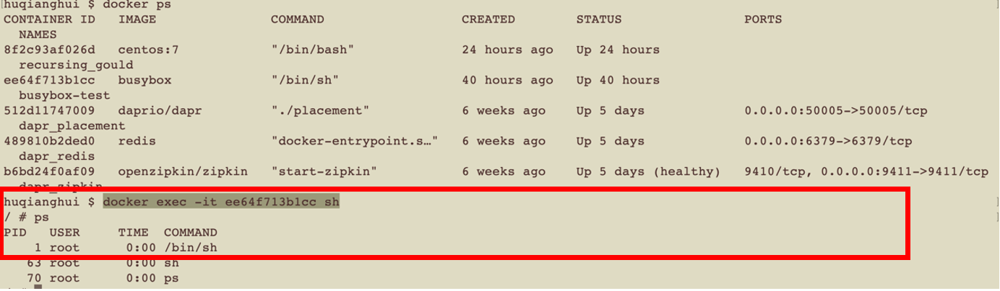

## cgroup资源限制

以cpu信息为例，来看通过cgroup实现cpu，内存等资源限制

### docker cpu限制配置

```shell
docker help run | grep cpu

```

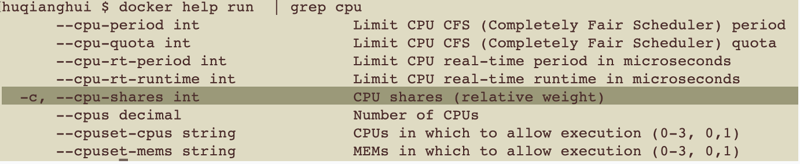

### docker cpu限制查看

```shell
docker run -it --rm --privileged --pid=host alpine:edge nsenter -t 1 -m -u -n -i sh

cd /sys/fs/cgroup/cpu/docker/ee64f713b1cc57cef14186c9b044bb52f2b47c6ab1a7bd4a7955d6071668b349/

cat cpu.shares 
```

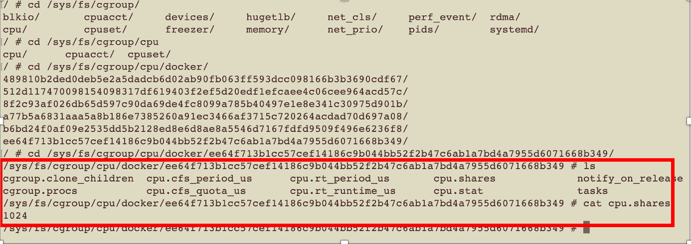

## 容器的capability

为了方便查看capability，我们是用centOS镜像来实验。

### 查看容器默认capability

```shell
docker ps

docker exec -it 8f2c93af026d /bin/bash

capsh --print
```

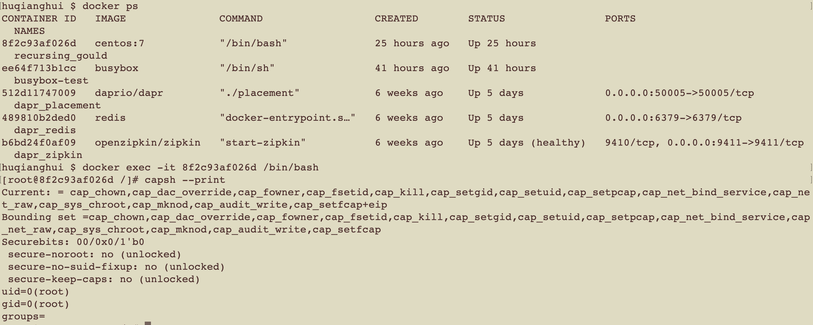

### 查看特权容器capability

```shell
docker run --privileged  -ti centos:7 /bin/bash

capsh --print
```

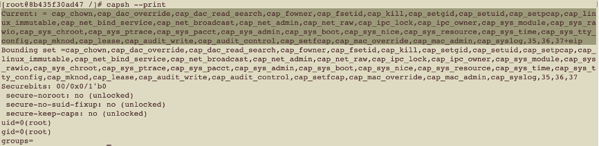

### 自定义容器capability

```shell
docker run --cap-drop all --cap-add net_admin -ti centos:7 /bin/bash

capsh --print
```

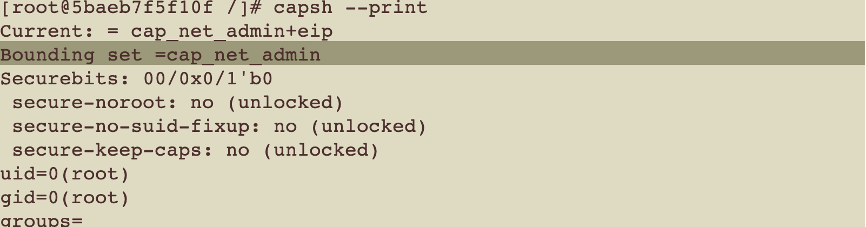