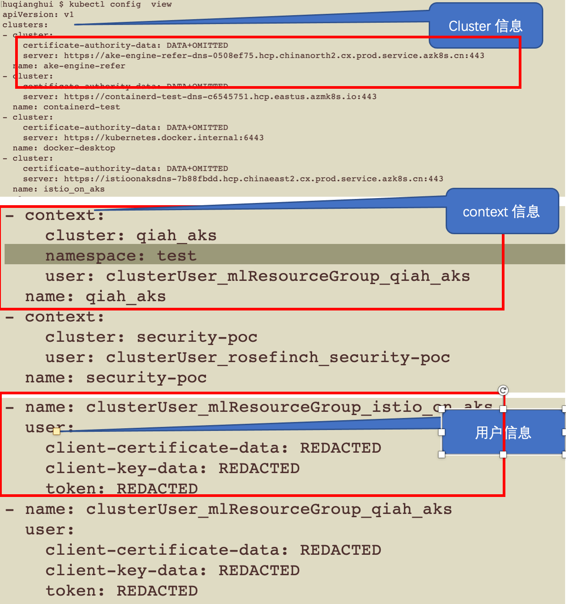
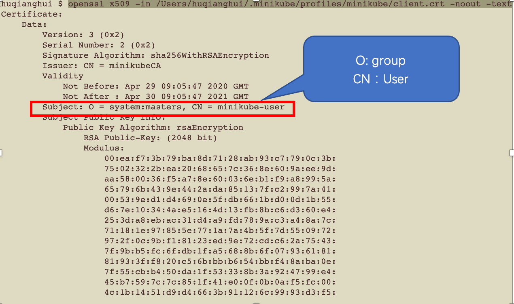
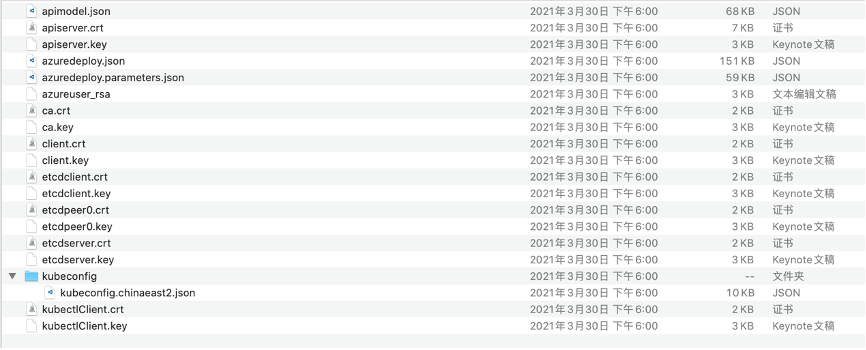
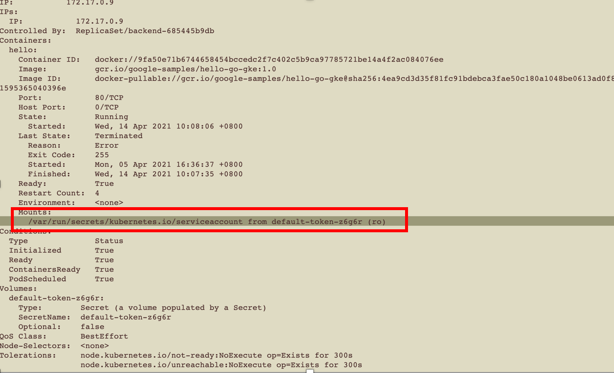
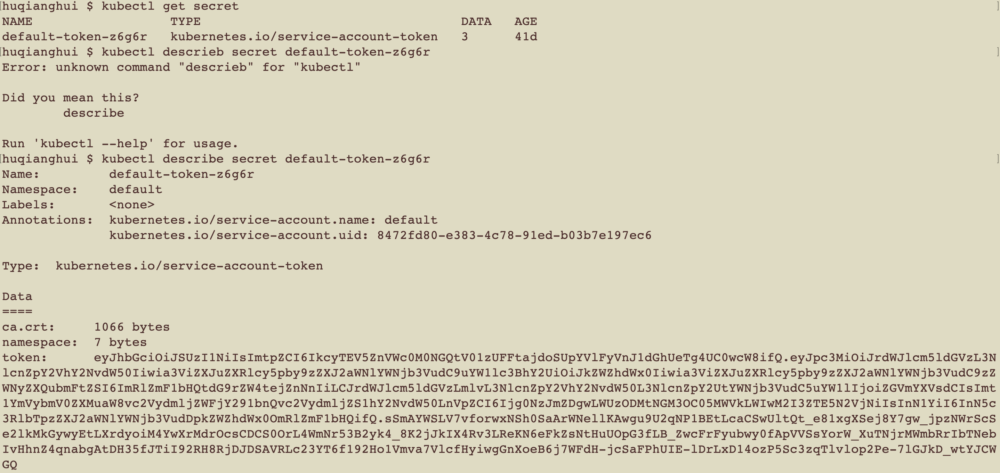
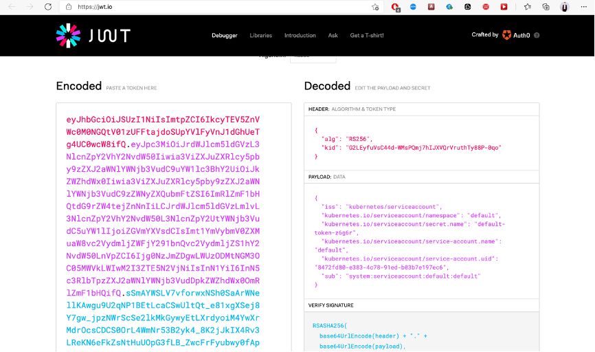

# kubernetes演示内容

## kubectl 查看配置的cluster，context，name等相关信息

```shell
kubectl config view
```



## 查看X509授权信息

授权证书等，都在api-server服务器上保留，通过私钥加密，公钥解密的方式认证。
获取到证书中的userName和group信息

```shell
openssl x509 -in /Users/huqianghui/.minikube/profiles/minikube/client.crt -noout -text
```



### 查看其它组件的证书信息和配置信息

```shell
cd /Users/huqianghui/Downloads/aks-engine-self/_output/self-aks-engine-test-6062a407
```



## 查看service account授权信息以及挂载

```shell

kubectl config use-context minikube

kubectl get pod

kubectl describe pod backend-685445b9db-6m62h
```



### 查看secret中的jwt内容

```shell

kubectl get sa

kubectl get secret

kubectl describe secret default-token-z6g6r
```




